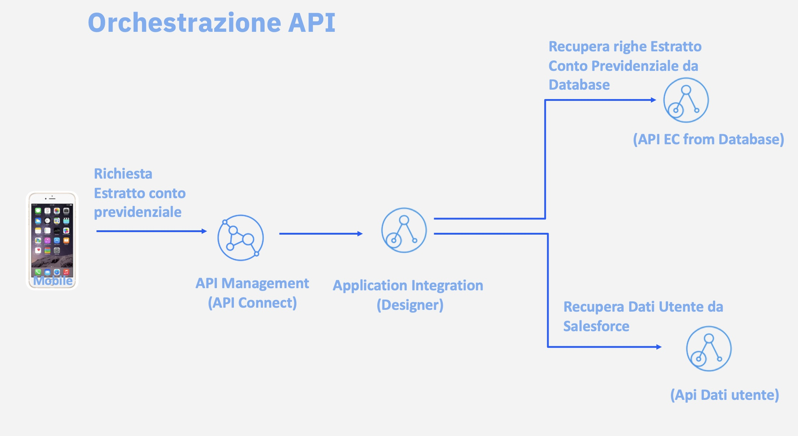

<!-- Page title left out so it can be generated -->

<PageDescription>

Il caso d'uso riguarda un esempio di estratto conto previdenziale.
Saranno implementate tre API con lo strumento no-code ACE Designer

</PageDescription>

<Row>
<Column colMd={6} colLg={6}>

  

</Column>
<Column colMd={6} colLg={6}>

</Column>
</Row>

<Row>
<Column>
I vari laboratori sono suddivisi e ripercorrono il seguente schema:

1. API di accesso ai dati dell'utente che sta richiedendo l'estratto conto recuprati da CRM esterno
2. API per estrazione delle righe dell'estratto conto da un Database DB2 con pubblicazione di un evento su un cluster Kafka
3. API che orchestra le API al punto 1. e 2.
4. L’API al punto 3. sarà poi pubblicata su API Connect perché possa esserne gestito il ciclo di vita in ottica di API management per far si che possa essere esposta, con tutte le caratteristiche di sicurezza ecc., come attualmente viene fatto proprio con API Connect dall’Istituto

Esempio dell'attuale flusso presente sul sito dell'ente previdenziale in cui l'estratto conto viene fatto utilizzando il proprio codice fiscale:
</Column>
</Row>

Esempi di orchestrazione a diagramma di flusso:
<Row>
<Column>

 
</Column>
</Row>
<Row>
<Column>

</Column>
</Row>
<Row>
<Column>

</Column>
</Row>
