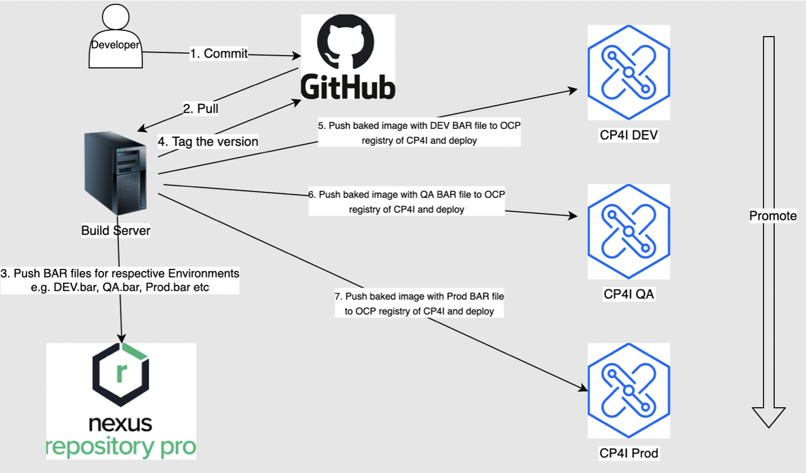
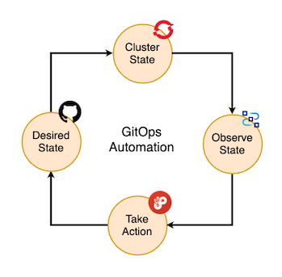

<PageDescription>

Le soluzioni IBM APP connect e IBM API connect sono stati creati e sviluppati nel corso degli anni con particolare attenzione alla condivisione
di artefatti e alla possibilità di integrarsi con strumenti di DevOps 

</PageDescription>

## Integrazione con strumenti di DevOps tradizionali
<Row>
  <Column>
 
Guardando la figura sottostante è possibile notare come i diversi flussi di integrazione sviluppati vengano poi deployati sui vari ambienti (sviluppo, test, QA, produzione)

E' possibile automatizzare e integrare ogni step della produzione degli artefatti al fine di semplificare la messa in produzione degli artefatti.

In [questa](https://community.ibm.com/community/user/integration/viewdocument/an-approach-to-build-devops-pipelin?CommunityKey=77544459-9fda-40da-ae0b-fc8c76f0ce18&tab=librarydocuments&LibraryFolderKey=164a97fe-1300-4314-be3d-ea70fdb840a7&DefaultView=folder) guida ad esempio è possibile vedere come integrare facilmente IBM App connect con strumenti di CI/CD come Jenkins.

 </Column>
</Row>

## Approccio GitOps applicato al Cloud Pak for Integration

<Row>
  <Column>
Un'ulteriore metodologia di sviluppo e messa in produzione è quella di usare un approccio <strong>GitOps.</strong>
GitOps offre un approccio Infrastructure as Code (IaC) utilizzando i repository Git come singola fonte di attendibilità. Il codice inviato controlla il processo CI, mentre il processo CD verifica e applica i requisiti di sicurezza, dell'Infrastructure as Code e qualsiasi altro vincolo impostato al framework applicativo. GitOps tiene traccia di qualunque modifica al codice per semplificare l'aggiornamento e fornire il controllo delle versioni in caso fosse necessario un rollback.

GitOps offre:

* Un flusso di lavoro standardizzato per lo sviluppo applicativo
* Maggiore sicurezza per poter definire fin da subito i requisiti delle applicazioni
* Maggiore affidabilità grazie alla visibilità e al controllo delle versioni forniti da Git
* Coerenza fra cluster, cloud e ambienti on premise

Gli strumenti che si possono utilizzare per creare un framework GitOps sono molti: repository Git, Kubernetes, strumenti di integrazione e distribuzione continue (CI/CD) e strumenti di gestione della configurazione.

Le singole funzionalità CP4I come API Connect e App Connect, vengono implementate individualmente in base alle esigenze per soddisfare ogni caso d'uso di integrazione. Tutti i componenti di CP4I possono essere combinati a piacere e vengono distribuiti al 100% come container. Ogni funzionalità è distribuita e gestita da un operatore corrispondente.

CP4I fornisce anche un Platform Navigator opzionale, un livello di interfaccia utente di gestione onnicomprensivo che fornisce un'esperienza di interfaccia utente comune per varie funzionalità di integrazione installate. Platform Navigator non è tenuto a implementare singole funzionalità CP4I, poiché ogni funzionalità di integrazione può essere implementata in modo indipendente sfruttando i suoi operatori di implementazione cloud native.

Inoltre, CP4I include una serie di servizi fondamentali, precedentemente noti come servizi comuni. L'ambito dei servizi di base si è evoluto rapidamente. Ad esempio, era un veicolo per fornire funzionalità di monitoraggio e registrazione pronte all'uso per i componenti di Cloud Pak. Tuttavia, come
poiché lo stesso OpenShift ha iniziato a fornire funzionalità per il monitoraggio del carico di lavoro, queste funzioni dei servizi di base sono state deprecate. Attualmente, i servizi di base si concentrano principalmente sulla gestione delle identità e degli accessi per l'interfaccia utente di Platform Navigator, l'esperienza di single sign-on per l'interfaccia utente, la misurazione delle licenze

Le funzionalità di integrazione di CP4I sono mostrate fianco a fianco in quanto vi è poca dipendenza diretta delle funzionalità di integrazione di CP4I sui servizi di base, ma nella tipica installazione di CP4I i servizi di base vengono installati automaticamente se si utilizza la licenza CP4I, per supportare completamente l'esperienza Cloud Pak.
In [questa](https://production-gitops.dev/guides/guides-overview/) guida, è possibile osservare il punto di vista di IBM, le best practice e le raccomandazioni su come dovrebbe essere una distribuzione di IBM API Connect pronta per la produzione, concentrandoci sull'uso di GitOps come metodologia di base per la distribuzione e la gestione delle funzionalità IBM come IBM API Connect in produzione.

 </Column>
</Row>