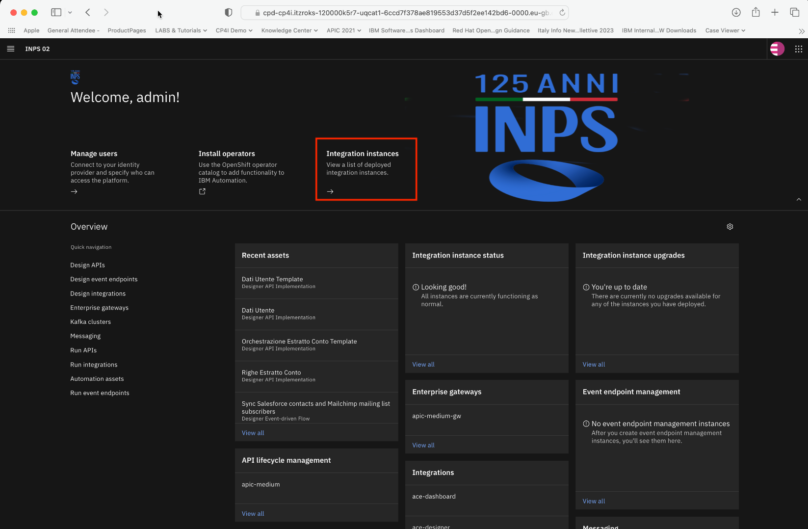

# Creazione di un'API per accesso ad un Database

<PageDescription>

L'obiettivo del primo laboratorio è quello di creare un flusso di integrazione che esponga i dati di un DB attraverso un API. Il laboratorio è stato già predisposto, creando una connessione ad un Database DB2 di test.
  

</PageDescription>

1. Colleghiamoci all'ambiente di laboratorio con utenza e password

  
2. Selezioniamo la voce <strong>ace-designer</strong> per accedere al menù di creazione dei flussi di integrazione

3. Clicchiamo sulla voce <strong>Create a flow by describing and integration</strong>

4. Cerchiamo nella barra di ricerca, i modelli di integrazione relativi al workshop, digitando il tag <strong>INPS</strong>

5. Visualizziamo la voce <strong>View matching templates</strong> per visualizzare i template e apriamo la voce <strong>Righe Estratto Conto Template</strong>

6. Clicchiamo sul pulsante <strong>+</strong> sulla destra per creare il flusso (<strong>Create from asset</strong>)

7. <strong>Importante!</strong> Rinominiamo il flusso in alto inserendo il nome del proprio utente (Dev xx)

8. Andiamo a visualizzare le <strong>proprietà</strong> del modello dati

9. Clicchiamo sul tab <strong>Operations</strong>><strong>Add a custom operation</strong> per creare una nuova azione

10. Completiamo il riquadro che descriva la nostra operation (Display name, operation name, HTTP verb=GET, Query Parameters=CODFIS) e clicchiamo sul pulsante <strong>Impelement Flow</strong>

11. Clicchiamo il pulsante <strong>+</strong> al centro del flusso per aggiungere la connessione al DB

12. Ricerchiamo il connettore di tipo JDBC, verifichiamo che sia selezionata la connessione <strong>Account 1</strong> e clicchiamo sulla voce <strong>custom query</strong>

13. Inseriamo una semplice query che ci permetta di recuperare i dati dalle tabeelle sul db

<code>
select * from NPT06801.RIGACONTRIBUTO as A, NPT06801.AZIENDA as B, where a.AziendaCodice =b.codiceAzienda and a.CF=
</code>

14. Clicchiamo sul pulsante sulla destra per ricercare ed associare il campo <strong>CODIFS</strong> alla query

15. Clicchiamo sul pulante a destra per confermare l'inserimento

16. Inseriamo un codice fiscale di esempio per verificare che la query sia stata correttamente inserita: (es codfis: RSSRST70A01F205X)

17. Clicchiamo sul pulsante sulla destra per testare il componente (<strong>Try this action</strong>)

18. Clicchiamo sul bottone <strong>Continua</strong>

19. Verifichiamo il risultato cliccando su <strong>View results</strong>

20. Si aprirà una finestra sulla destra che ci mostrerà i dati recuperati

21. Cliccando sul tab output potremmo analizzare i dati recuperati

22. Torniamo nella finestra principale e aggiungiamo un parsing dei dati json a valle del recupero dei dati cliccado sull'immagine <strong>+</strong>

23. Selezioniamo il tab <strong>toolbox</strong> e la voce <strong>JSON parser</strong>

24. Clicchiamo sul bottone a desta ed andiamo a selezionare la voce <strong>Data</strong>

25. In questo modo comparirà la voce di dettaglio con il JSON di esempio

26. Clicchiamo su <strong>Generata Schema</strong> per recuperare il formato dei dati

27. Nella parte in basso, verrà creato uno schema dati JSON a partire dai dati di esempio

28. Ritorniamo sul flusso principale e clicchiamo sull'ultimo blocco <strong>Response</strong>

29. Clicchiamo sull bottone a destra in corrispondenza della voce <strong>righe</strong> e selezioniamo la voce <strong>Parsed JSON</strong>

30. Associamo al campo <strong>progressivo</strong> il campo <strong>PROGRESSIVO</strong> recuperato dal JSON

31. Continuiamo l'associazione dei campi selezionando il campo <strong>dal</strong> 

32. Completiamo l'associazione per tutit gli altri campi (Tipo-contribuzione, tipo-contributo, diritto, calcolo, euro, lire, codice e descrizione) come indicato nell'immagine

33. Clicchiamo sul bottone in alto <strong>Try this action</strong> per testare il flusso

34. Clicchiamo su <strong>Continue</strong> nel messaggio di warning

35. Verifichiamo che i dati siano stati effettivamente recuperati (200 OK) e clicchiamo sulla voce <strong>view results</strong>

36. Passiamo alla modalità <strong>Output</strong> e <strong> < / ></strong> per verificare il sorgente di output della risposta

37. Chiudiamo il menù di output

38. Adniamo infine ad aggiungere nel flusso principale un ulteriore step cliccando sull'immagine <strong>+</strong>, prima della figura <strong>Response</strong>

39. Ricerchiamo il connettore <strong>Kafka</strong>, verifichiamo che l'account selezionato sia <strong>Account 1</strong> ed all'interno della voce <strong>Message</strong>, selezioniamo il campo <strong>Send message</strong>

40. Selezioniamo il topic Kafka su cui andare ad inviare il messaggio

41. Selezioniamo il topic <strong>WORKSHOP</strong>

42. Completiamo i campi in basso per associare la coppia chiave valore del messaggio, indicando come:
ClientID = DEVXXX (nome utente) e selsezioniamo il valore Key = OBject>CODIFIS

43. Aggiungiamo il prefisso DEVXX- con il proprio nome utente al valore <strong>key</strong>, in modo che ogni utente pubblicherà i messaggi con una chiave diversa.

44. Selezioiamo per la voece <strong>Payload</strong> il menù a destra> <strong>All messages</strong>

45. Associamo il campo <strong>jdbc>Data</strong> al campo <strong>Payload</strong>

46. Clicchiamo sul tasto in alto <strong>Try this flow</strong> per testare nuovamente il flusso

47. Verifichiamo che la risposta sia 200 OK e andiamo a verificare che il messaggio sia stato scritto anche su Kafka cliccando sull'hamburger menù in alto a sinistra

48. Navighiamo nel menù e clicchiamo la voce <strong>Amminstration>Integration Instances</strong>

49. Clicchiamo sulla voce <strong>event-streams</strong>

50. Clicchiamo sulla seconda icona del menù sulla sinistra <strong>topics</strong>

51. Clicchiamo sul topic <strong>WORKSHOP</strong>

52. Verifichiamo all'interno dei topic la presenza dei messaggi

53. Analizziamo l'output del messaggio inserito

