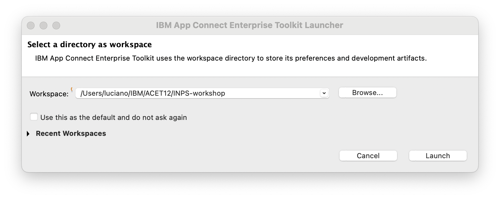
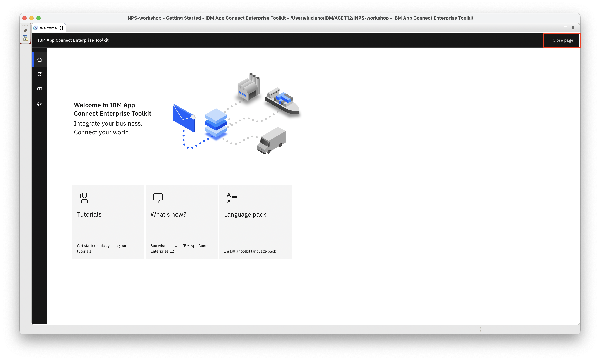

# Lab5 - Panoramica sull'utilizzo di ACE Toolkit

L'obiettivo del laboratorio è quello di fornire una panoramica sello strumento avanzato ACE Toolkit

1. Scaricare il file" Project Interchange per ACE Toolkit"

1. Eseguire ACE Toolkit e specificare una cartella di lavoro (workspace)  

    
1. Chiudere la pagina di Benvenuto  
    

1. Con il bottone destro sulla riga Integration servers della finestra in basso a sinistra creare un "Server Locale" mantenedo tutti i default

  
    

1. Cliccare sul server appena create ed effettuare lo stop

1. da "File->Import" selezionare Project Interchange

1. Selezionare il file scaricato all'inizio ed effeture l'import di tutte le risorse

1. Copiare il file e la cartella come indicato

1. Avviare il sever di test  nella finestra in basso a sinistra
